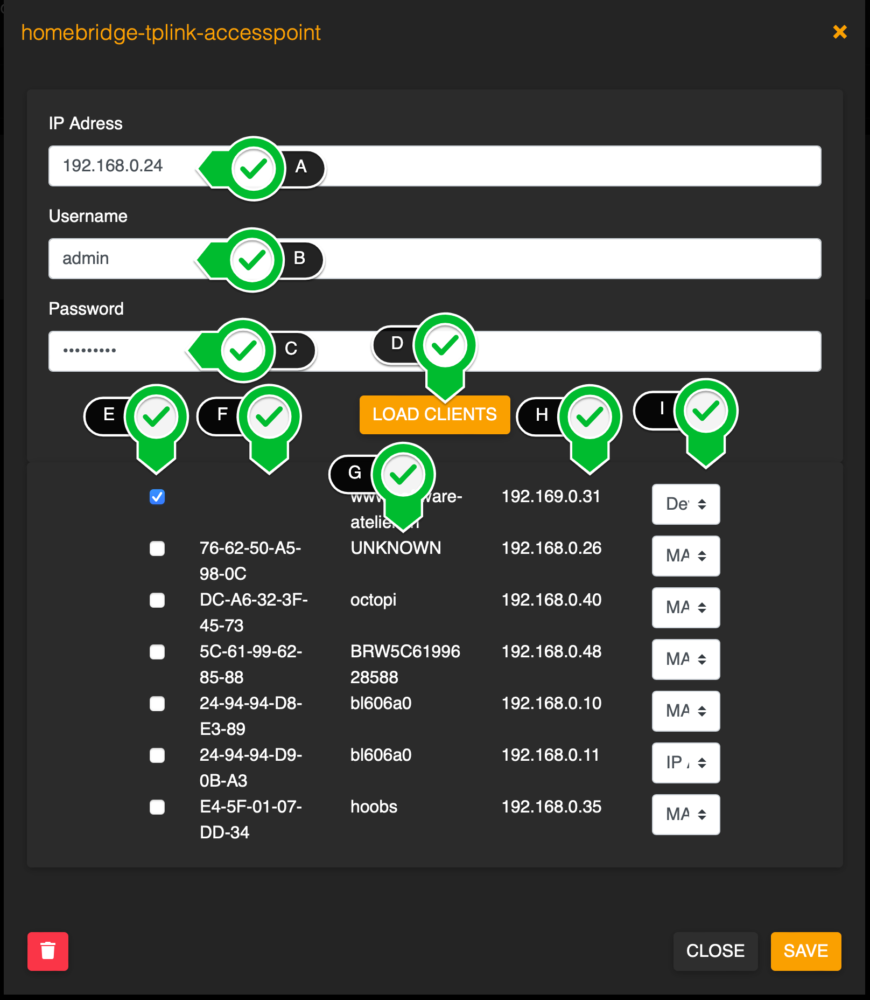

Homebridge Plugin to integrate TP-Link Access points for Occupancy Detection.

Access Point Clients can be configured as Occupancy Sensors.


# Known issues
- The plugin should not run while administrating the access point. Otherwise, the user automatically gets logged out from the Access Points Web Interface within seconds.
- No UI Configuration for multiple access points.
- Clients (Occupancy Sensors) can be disabled but not yet removed in UI Config.
- Changes in the Config UI may do not affect a running instance. Restart the plugin in case it does not work.

# Configuration
## User Interface


A) The Access Points IP Adress

B) The Username for authentication on the Access Point

C) The Access Points Password

D) Load all connected clients and all already configured clients

E) Enable this client as an Occupancy Sensor

F) the clients MAC Address

G) The clients name

H) The clients IP Address

<a name="identifier"></a>I) How to identify the client. Usually, the Mac Address is the best option. Some Devices (iOS Devices for example by default) can obfuscate their MAC Adress by generating fake MAC Adresses.
In this case it is recommended to use another field for for identification. If you use static IP Adresses, then use the IOP Adress. Otherwise, the best option is the device name. But you should not chanche the Device name, once you configured it.

## Example Config JSON

``` JSON
{
            "platform": "TP-Link Access Point",
            "name": "TP-Link WiFi",
            "ip": "192.168.0.5",
            "user": "admin",
            "pass": "*********",
            "clients": [
                {
                    "name": "my iPhone",
                    "ip": "192.169.0.31",
                    "mac": "AA-BB-CC-DD-12-34",
                    "identifier": "name",
                    "enabled": true
                },
                {
                    "name": "Galaxy S",
                    "ip": "192.168.0.26",
                    "mac": "AA-BB-CC-DD-12-35",
                    "identifier": "mac",
                    "enabled": false
                },
                {
                    "name": "Macbook Air",
                    "ip": "192.168.0.40",
                    "mac": "DF-A6-32-3F-44-81",
                    "identifier": "ip",
                    "enabled": false,
                    "selector": "name"
                }
            ]
        }
```

`identifier`: `mac` | `ip` | `name`. For Details, see [here (User interface)](#identifier)


## Troubleshooting
In case the plugin can not start because of missing hap-nodejs, install hap-nodejs in the terminal:

```bash
sudo npm install -g --unsafe-perm hap-nodejs@latest
```
